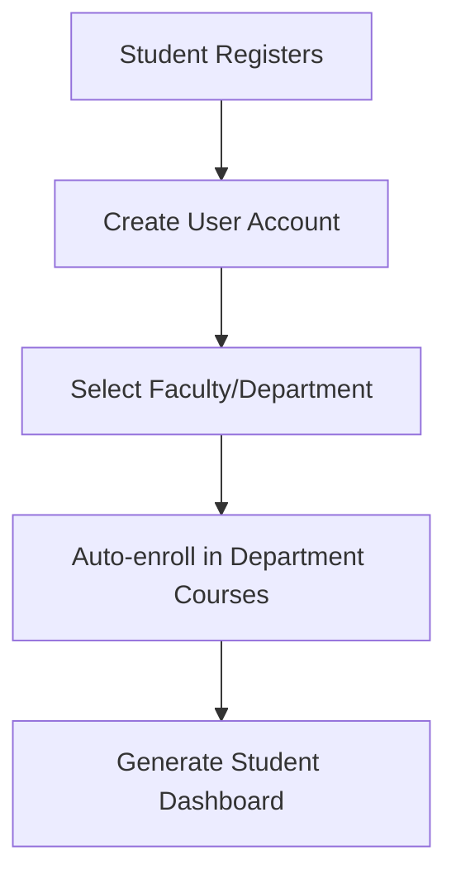
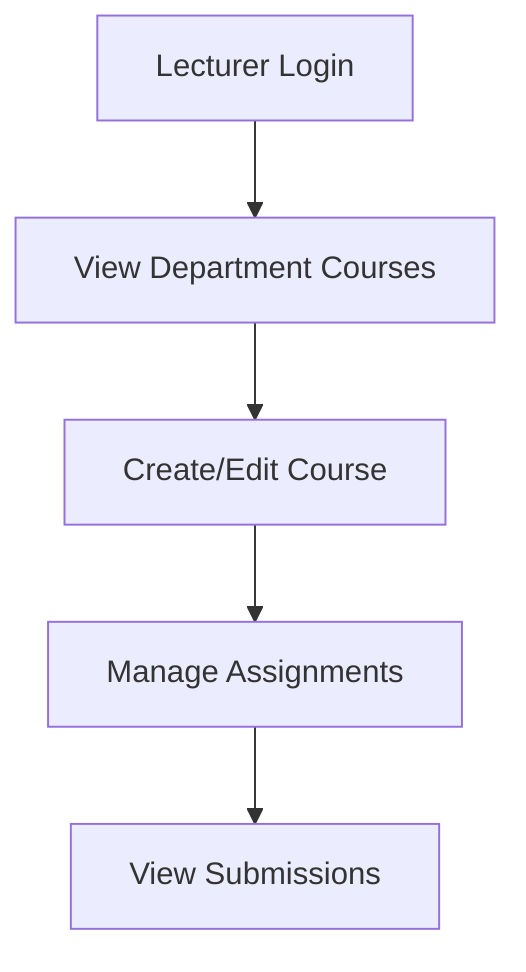

# University Management System - Implementation Plan

## 1. Core Features & Workflows

### Student Registration & Course Enrollment


### Course Management


## 2. Project Structure
```
university_management/
├── accounts/          # User authentication and profiles
├── schools/           # Faculty and department management
├── courses/           # Course and enrollment handling
├── assignments/       # Assignment and submission system
└── core/             # Common functionality and settings
```

## 3. Database Models

### accounts app
```python
class User(AbstractUser):
    USER_TYPE_CHOICES = (
        ('student', 'Student'),
        ('lecturer', 'Lecturer'),
    )
    user_type = models.CharField(max_length=10, choices=USER_TYPE_CHOICES)
    department = models.ForeignKey('schools.Department', on_delete=models.SET_NULL, null=True)
    registration_number = models.CharField(max_length=20, unique=True, null=True)  # For students
    staff_number = models.CharField(max_length=20, unique=True, null=True)  # For lecturers
```

### schools app
```python
class School(models.Model):
    name = models.CharField(max_length=100)
    code = models.CharField(max_length=10, unique=True)

class Department(models.Model):
    name = models.CharField(max_length=100)
    code = models.CharField(max_length=10, unique=True)
    school = models.ForeignKey(School, on_delete=models.CASCADE)
    required_courses = models.ManyToManyField('courses.Course', related_name='required_by_departments')
```

### courses app
```python
class Course(models.Model):
    code = models.CharField(max_length=10, unique=True)
    name = models.CharField(max_length=200)
    department = models.ForeignKey('schools.Department', on_delete=models.CASCADE)
    lecturer = models.ForeignKey('accounts.User', on_delete=models.SET_NULL, null=True)
    description = models.TextField()
    
class Enrollment(models.Model):
    student = models.ForeignKey('accounts.User', on_delete=models.CASCADE)
    course = models.ForeignKey(Course, on_delete=models.CASCADE)
    date_enrolled = models.DateTimeField(auto_now_add=True)
    status = models.CharField(max_length=20, choices=[
        ('active', 'Active'),
        ('completed', 'Completed'),
        ('dropped', 'Dropped')
    ])
```

### assignments app
```python
class Assignment(models.Model):
    title = models.CharField(max_length=200)
    description = models.TextField()
    course = models.ForeignKey('courses.Course', on_delete=models.CASCADE)
    due_date = models.DateTimeField()
    total_marks = models.DecimalField(max_digits=5, decimal_places=2)
    
class Submission(models.Model):
    assignment = models.ForeignKey(Assignment, on_delete=models.CASCADE)
    student = models.ForeignKey('accounts.User', on_delete=models.CASCADE)
    submitted_date = models.DateTimeField(auto_now_add=True)
    content = models.TextField()
    marks = models.DecimalField(max_digits=5, decimal_places=2, null=True)
```

## 4. Key Views & Templates

### Student Views
- Registration view with department selection
- Dashboard showing enrolled courses
- Assignment submission interface
- Course details view

### Lecturer Views
- Course management dashboard
- Assignment creation and grading
- Student submission review
- Course material upload

### Templates Structure
```
templates/
├── base.html                  # Base template with navigation
├── accounts/
│   ├── register.html         # Registration form
│   ├── login.html           
│   └── dashboard.html        # Role-based dashboard
├── courses/
│   ├── list.html            # Course listing
│   ├── detail.html          # Single course view
│   └── manage.html          # Lecturer course management
└── assignments/
    ├── create.html          # Create assignment
    ├── submit.html          # Submit assignment
    └── grade.html           # Grade submissions
```

## 5. Implementation Phases

1. **Phase 1: Authentication & User Management** (1-2 days)
   - Set up Django project
   - Implement custom User model
   - Create registration and login views
   - Set up base templates

2. **Phase 2: Faculty & Course Structure** (2-3 days)
   - Create School and Department models
   - Implement Course model
   - Set up automatic enrollment system
   - Create course listing views

3. **Phase 3: Assignment System** (2-3 days)
   - Implement Assignment model
   - Create submission system
   - Set up assignment viewing and submission interfaces
   - Implement basic grading functionality

4. **Phase 4: Dashboard & UI** (1-2 days)
   - Create student dashboard
   - Implement lecturer course management
   - Style with Bootstrap
   - Add navigation and user feedback

## 6. Technical Specifications

### Authentication Flow
- Students and lecturers register with email/password
- Students must select department during registration
- Auto-enrollment happens after department selection
- Different dashboards based on user_type

### Automatic Course Enrollment
- Department has required_courses field
- On student registration:
  1. Create user account
  2. Associate with department
  3. Create enrollments for all required courses
  4. Redirect to dashboard

### Security Measures
- Django's built-in authentication
- Permission-based view access
- CSRF protection
- Form validation
- Secure password handling